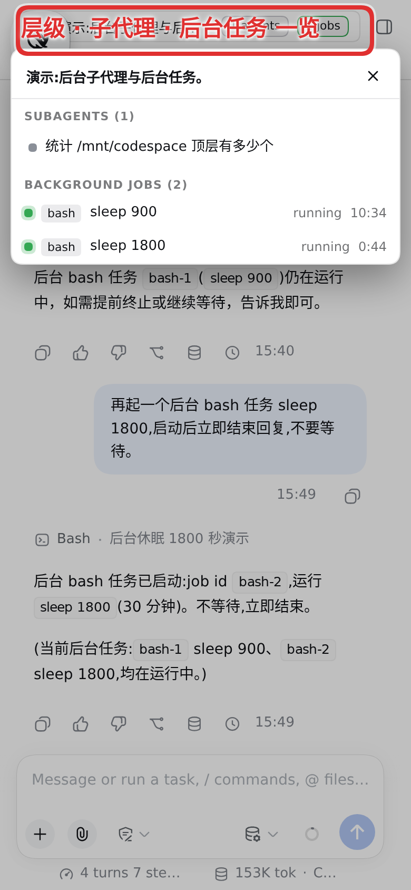

# dsh-mobile-upgrade

[English](../../README.md) | [简体中文](../zh-Hans/README.md) | [繁體中文](../zh-Hant/README.md) | [日本語](../ja/README.md) | 한국어 | [Español](../es/README.md) | [Français](../fr/README.md) | [Deutsch](../de/README.md) | [Русский](../ru/README.md)

[DeepSeek Harness](https://github.com/deepseek-ai/deepseek-harness)(`dsh`) 웹 프로파일을 위한 모바일 UI 개선 플러그인입니다. 모든 렌더링은 호스트 자체의 슬롯과 상태 시그널을 통해 이루어집니다 — 레이아웃 takeover도, 떠 있는 위젯도, 채팅 내용의 DOM 폴링도 없습니다.

## 제공되는 기능

- **재시작 행** — 설정 → 일반에 "서비스 재시작" 항목을 추가합니다. 먼저 확인한 뒤 `dsh` 프로세스를 재시작하고, 서비스가 다시 응답하면 페이지를 자동으로 새로 고칩니다.
- **입력 모달리티 스위치** — 네이티브 프로바이더 편집 폼의 각 모델 행에 text/image/video 체크박스를 추가하여 모델의 `input` 배열을 `settings.yaml`에 기록합니다(파일 옆에 백업 생성). 사용자가 커스터마이즈하지 않은 카탈로그 모델은 읽기 전용으로 표시됩니다.
- **좁은 화면 드로어** — 1024px 이하에서 사이드바는 호스트 자체 토글을 유지하는 작은 코너 칩으로 줄어듭니다. 펼치면 전체 사이드바가 전체 폭 콘텐츠 위에 드로어로 떠 오르고, 세션을 고르면 다시 닫힙니다. 칩과 드로어는 원자적으로 교체되며(메인 스레드가 바쁠 때 멈춰 버릴 지오메트리 애니메이션이 없습니다), 드로어를 닫는 탭은 호스트의 리렌더링을 기다리지 않고 같은 프레임에서 접습니다 — 따라서 많은 세션을 돌리는 휴대폰에서도 드로어가 반쯤 펼쳐진 채 남지 않고, 닫힌 칩이 호스트가 이미 비운 레일 위에 하얗게 남는 일도 없습니다.
- **좁은 화면 설정 탭** — 700px 이하에서 설정 대화상자의 사이드 내비게이션이 가로 스크롤 탭 행으로 바뀝니다.
- **전체 폭 모델 메뉴** — 700px 이하에서 컴포저의 모델 메뉴가 화면 밖으로 벗어나는 대신 정확히 화면 폭(좌우 12px 여백)으로 다시 앵커됩니다. 트리거 위라는 세로 배치는 계속 호스트가 담당합니다.
- **스크롤 가능한 질문 카드** — 1024px 이하에서 대기 중인 질문이 더 이상 자기 선택지를 덮어 버리는 일이 없습니다. 질문은 자체 스크롤 영역에 들어가도록 높이 상한이 걸리고, 긴 질문은 제자리에서 스크롤되는 동안 그 아래의 선택지 목록은 남은 공간을 그대로 차지하므로, 선택지와 제출 행, 최소화/닫기 버튼은 화면에 남아 계속 누를 수 있습니다. 짧은 질문은 그대로이며 카드는 여전히 내용에 딱 맞게 표시됩니다.
- **상세 오버레이 처리** — 현재 호스트에서 닫기 컨트롤이 작동하지 않는 전체 화면 도구 상세 오버레이는 좁은 화면에서 렌더링하지 않아 채팅을 가둘 수 없습니다.
- **폭풍에 안전한 반응성** — 드로어/메뉴 옵저버와 설정 폴러는 스트리밍 메시지 폭주를 제한된 속도로 반응하고 호스트에 닿을 수 없는 동안에는 백오프합니다. 재접속 중 레일이 다시 마운트될 때는 드로어 상태를 유지해 펄럭이지 않고, 드로어를 닫는 탭은 낡은 토글에 떨어지는 대신 다시 마운트를 통해 재시도합니다 — 많은 세션이 동시에 스트리밍해도 열려 있든 닫혀 있든 입력이 얼어붙거나 사이드바가 클릭 불가능하게 뒤틀리는 일이 없어집니다.
- **서브에이전트 카탈로그 가드** — 호스트는 서브에이전트 카탈로그를 요청마다 전체 세션 코퍼스를 열거하여 제공하고(긴 기록에서는 약 1초), 그 클라이언트는 선택, 칩 호버, 멤버십 이벤트마다 요청합니다. 플러그인이 이 새로 고침을 감쌉니다. 라이브 세션 목록에 자식이 없는 부모에게는 아예 묻지 않고, 같은 부모에는 최대 2.5초에 한 번만 다시 물으며, 새로 고침 시작은 서로 간격을 벌입니다 — 서브에이전트 팬아웃이 전체 코퍼스 스캔으로 호스트를 굶기는 일이 없어집니다.
- **클릭으로 여는 리니지 칩** — 데스크톱에서 서브에이전트 칩("N subagents"와 서브에이전트 제목 스위처)은 현재 호스트에서 호버로만 열리고 클릭에는 아무 일도 일어나지 않습니다. 플러그인이 칩 위의 클릭을 호스트가 이미 이해하는 호버 이벤트 쌍으로 변환해 클릭으로 트리를 열고 닫을 수 있게 합니다(조상 크럼브는 클릭 탐색을 유지합니다).
- **좁은 화면 헤더 수집기** — 1024px 이하에서 세션 헤더의 칩(리니지, 작업, 프리셋)은 화면보다 넓고 호버 전용입니다. 이 칩들은 하나의 필(`≡ 제목 · N agents · M jobs`)로 접히며, 탭하면 전체 폭 시트가 열립니다. 그 안에는 세션 리니지(각 조상은 탭할 수 있고 각자의 자손 수가 표시됨), 패밀리 루트를 뿌리로 하는 서브에이전트 트리 — 행은 라이브 세션 목록에서 렌더링되고 브랜치는 가드된 새로 고침을 통해 필요할 때 카탈로그를 가져옵니다 — 그리고 이 세션의 백그라운드 작업이 담겨 있습니다. 데스크톱에서는 아무 것도 바뀌지 않습니다.
- **자가 업데이트** — 클라이언트 번들은 리비전별로 불변으로 제공되기 때문에 휴대폰 탭은 오래된 빌드를 며칠씩 계속 돌릴 수 있습니다. 페이지는 부팅된 리비전을 서버가 지금 게시하는 리비전과 비교하여, 페이지가 유휴일 때(초안을 입력하는 중에는 절대) 스스로 새로 고치거나 탭할 수 있는 배너를 내놓습니다.
- **세션 목록 렌더 스로틀** — 호스트는 연결된 모든 세션의 프로젝션 변경마다 전체 값 프레임을 푸시하고, 실행 중인 서브에이전트의 타이밍 뷰는 커밋된 이벤트마다 변하므로, 바쁜 백그라운드 함대는 초당 50-150개 프레임을 페이지로 흘려보냅니다. 각 프레임은 세션 목록 전체를 다시 렌더링했습니다(재구축 한 번이 모든 요약과 O(n²) 캐시 스위프를 돌며 — 메인 스레드 시간의 대부분으로 측정되어 페이지가 새로고침 전까지 얼었습니다). 플러그인은 이 재렌더링을 적응형 후속 간격으로 묶는 한편, 값은 변함없이 세션별 스토어로 계속 흘러갑니다 — 백그라운드 스트리밍은 새 세션이든 오래된 세션이든 페이지를 얼리지 않습니다.
- **기능별 토글** — 플러그인은 설정 → 플러그인에 `dsh-mobile-upgrade` 섹션을 설치하여 기능별 스위치를 제공합니다.

## 스크린샷

플로팅 칩, 세션 드로어, 좁은 화면 설정 탭, 좁은 화면 헤더 수집기(주석 포함):

| | |
|---|---|
|  |  |
|  |  |

## 설치

```sh
dsh plugin --profile web add dsh-mobile-upgrade
```

`dsh web`을 재시작한 뒤 휴대폰에서 웹 프로파일을 열면: 재시작 행은 설정 → 일반에, 기능 토글은 설정 → 플러그인 → dsh-mobile-upgrade에 있습니다. 첨부 파일은 호스트 컴포저의 기본 첨부 시스템을 사용합니다.

`dsh` 0.1.5-rc.1 이상이 필요합니다(호스트 내장 첨부 시스템이 이 플러그인의 업로드 기능을 대체했습니다).

## 설정

플러그인 설정 카드:

| 키 | 기본값 | 의미 |
|---|---|---|
| `restartEnabled` | `true` | 재시작 행과 해당 라우트 제공 |

## 기능 토글

위의 모든 기능은 설정 → 플러그인 → dsh-mobile-upgrade에서 전환할 수 있습니다(다음 페이지 로드 시 적용). 또는 `localStorage` 키 — `mfx-restart`, `mfx-settle`, `mfx-drawer`, `mfx-settings`, `mfx-modality`, `mfx-menus`, `mfx-net`, `mfx-questions`, `mfx-selfupdate`, `mfx-agents`, `mfx-header`, `mfx-listthrottle` — 로 기기별로 재정의할 수 있으며, 값 `"0"`은 기능을 끕니다.

## 알려진 제한

- 클라이언트는 호스트 UI의 해시된 CSS 클래스명(메뉴, 드로어 토글, 프로바이더 편집기, 세션 헤더 칩)으로 후크합니다. 호스트 빌드가 이 클래스명을 바꾸면 이 플러그인이 따라잡을 때까지 해당 기능은 저하되며, 나머지 기능은 계속 동작합니다. 질문 카드의 질문 영역은 대신 카드 자체의 `data-question-key` 훅을 통해 찾으므로, CSS 모듈을 다시 해시하기만 하는 호스트 재빌드에서도 계속 동작합니다.
- 헤더 수집기와 리니지 클릭 심은 호스트 자체 데이터(라이브 세션 목록과 그 서브에이전트 카탈로그) 위에 얹혀 있습니다. 가드된 브랜치 가져오기 외에는 요청을 추가하지 않으며, 모드가 아직 로드 중인 행을 탭하면 해당 카탈로그가 도착한 뒤 저절로 완료됩니다.
- 입력 모달리티 스위치는 직접 커스터마이즈한 프로바이더 라우트만 패치할 수 있습니다. 카탈로그 전용 라우트는 설계상 읽기 전용입니다 — 카탈로그 섹션을 임의로 만들면 모델 디렉터리가 무너지기 때문입니다.

## 보안 참고

플러그인의 HTTP 라우트(재시작, 설정 편집)는 자체 인증을 수행하지 않습니다 — 로드된 `dsh` 웹 서피스를 신뢰합니다. localhost 밖으로 노출하기 전에 UI의 나머지 부분을 보호하는 것과 같은 게이트(리버스 프록시 인증, 루프백 바인딩) 뒤에 두세요.

## 커뮤니티 링크

- [Linux.Do](https://linux.do) — 기술을 공유하고 논의하는 커뮤니티입니다.

## 라이선스

[Synthetic Source License(SySL) Version 1.0](LICENSE)로 배포됩니다.

> NOTICE: This software includes code generated by artificial intelligence. See the LICENSE file for the Synthetic Source License terms, including model disclosure requirements.
