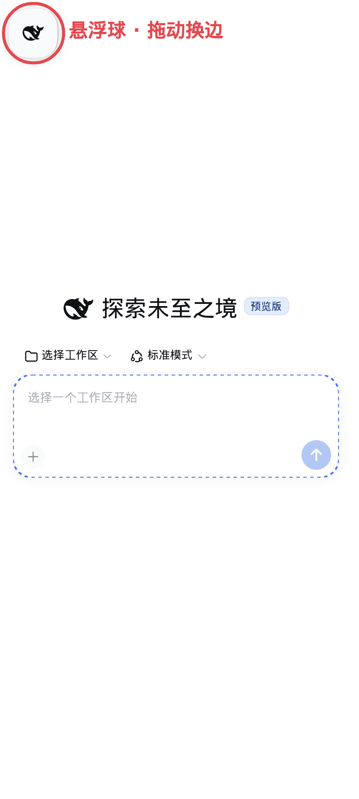
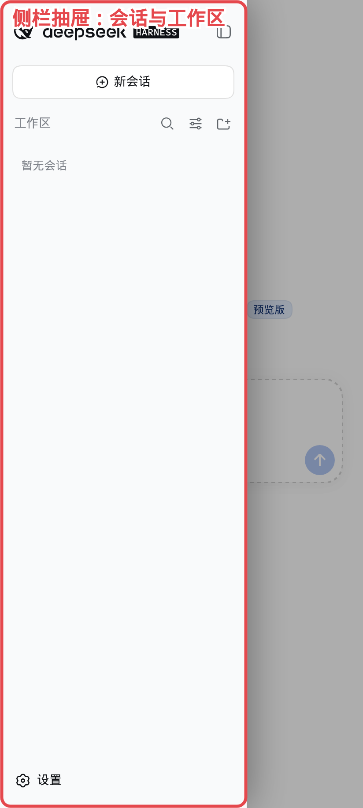
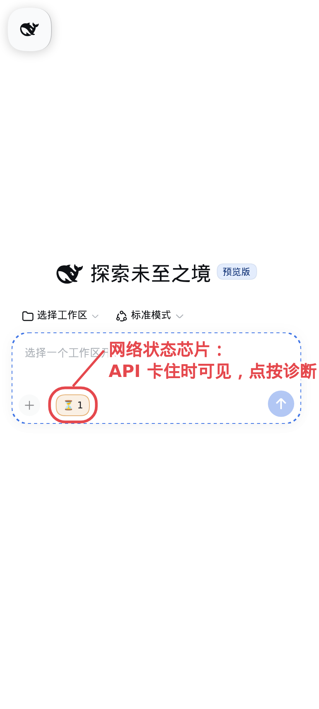
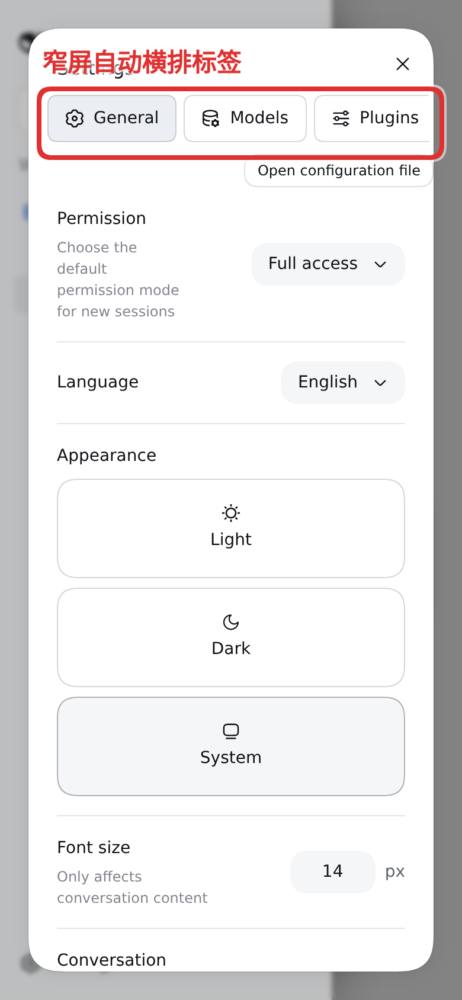
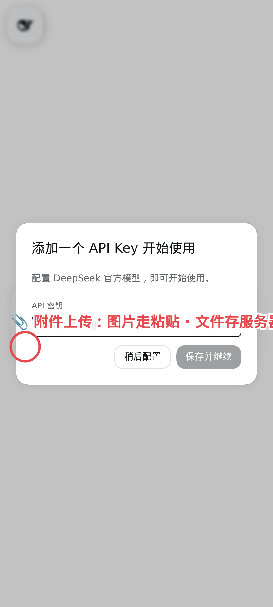

# dsh-mobile-upgrade

[English](../../README.md) | [简体中文](../zh-Hans/README.md) | 繁體中文 | [日本語](../ja/README.md) | [한국어](../ko/README.md) | [Español](../es/README.md) | [Français](../fr/README.md) | [Deutsch](../de/README.md) | [Русский](../ru/README.md)

面向 [DeepSeek Harness](https://github.com/deepseek-ai/deepseek-harness)（`dsh`）web profile 的行動版體驗修復，以單一外掛交付。所有介面皆透過宿主自身的槽位與狀態訊號呈現——不接管版面、不放浮動元件、不輪詢聊天內容。

## 你會得到

- **輸入框附件上傳** — 輸入框工具列旁多一枚迴紋針按鈕。圖片走編輯器原生貼上附件鏈路；其他檔案上傳到伺服器，把絕對路徑貼進草稿，agent 用檔案工具即可讀取。
- **重新啟動服務列** — 設定 → 一般裡多一條「重新啟動服務」。先確認，再重新啟動 `dsh` 程序，服務恢復應答後頁面自動重新整理。
- **輸入模態開關** — 原生供應商編輯表單的每個模型列上追加 text/image/video 核取方塊，把模型的 `input` 陣列寫回 `settings.yaml`（寫入前備份）。未自訂過的目錄模型僅唯讀顯示開關。
- **窄螢幕抽屜側欄** — 1024px 以下側欄收成角落小晶片，只保留宿主自己的開關；展開時完整側欄以抽屜浮在全寬內容之上，選取會話自動收合。
- **窄螢幕設定標籤** — 700px 以下設定對話框的側向導覽變成一行可水平捲動的標籤。
- **全寬模型選單** — 700px 以下輸入框的模型選單重新錨定為正好手機寬度（左右各 12px 邊距），不再落到螢幕外；垂直落點（觸發器上方）仍由宿主負責。
- **詳細面板防呆** — 目前宿主的全螢幕工具詳細面板關閉控件失效，窄螢幕上不再渲染它，聊天不會被擋住。
- **逐功能開關** — 外掛在 設定 → 外掛 裡安裝 `mobile-ui-fix` 設定節，每個功能一枚開關。

## 截圖

懸浮球、側欄抽屉、網路狀態晶片、窄螢幕設定標籤與輸入框附件按鈕（含標註）：

| | |
|---|---|
|  |  |
|  |  |
|  | |

## 安裝

```sh
dsh plugin --profile web add dsh-mobile-upgrade
```

重新啟動 `dsh web`，然後在手機上開啟 web profile：迴紋針在輸入框旁，重新啟動列在 設定 → 一般，功能開關在 設定 → 外掛 → mobile-ui-fix。

需要 `dsh` 0.1.2-rc.1 或更新版本。

## 設定

外掛設定卡提供：

| 鍵 | 預設值 | 意義 |
|---|---|---|
| `uploadDir` | `<dsh home>/mobile-uploads` | 非圖片上傳檔案的儲存目錄 |
| `restartEnabled` | `true` | 提供重新啟動服務列及其路由 |

## 功能開關

上文每個功能都可以在 設定 → 外掛 → mobile-ui-fix 裡切換（下次頁面載入生效），也可以按裝置用 `localStorage` 鍵覆寫——`mfx-attach`、`mfx-restart`、`mfx-settle`、`mfx-drawer`、`mfx-settings`、`mfx-modality`、`mfx-menus`——值為 `"0"` 即關閉該功能。

## 已知限制

- 客戶端按宿主 UI 的雜湊 CSS 類別名稱（選單、抽屜開關、供應商編輯器）掛鉤。宿主建置若重新命名這些類別，對應功能會降級，待本外掛跟進調整；其餘功能不受影響。
- 輸入模態開關只能補寫你自行自訂過的供應商路由；純目錄路由依設計唯讀——憑空造一個目錄節會導致模型目錄崩塌。

## 安全說明

外掛的 HTTP 路由（上傳、重新啟動、設定編輯）自身不做任何鑑別——它們信任所載入的 `dsh` web 表層。對外暴露部署之前，請把它放到保護其餘介面的同一道閘門之後（反向代理認證、僅回環繫結）。

## 授權

以[合成原始碼授權條款（SySL）1.0 版](LICENSE)散佈。

> NOTICE: This software includes code generated by artificial intelligence. See the LICENSE file for the Synthetic Source License terms, including model disclosure requirements.
